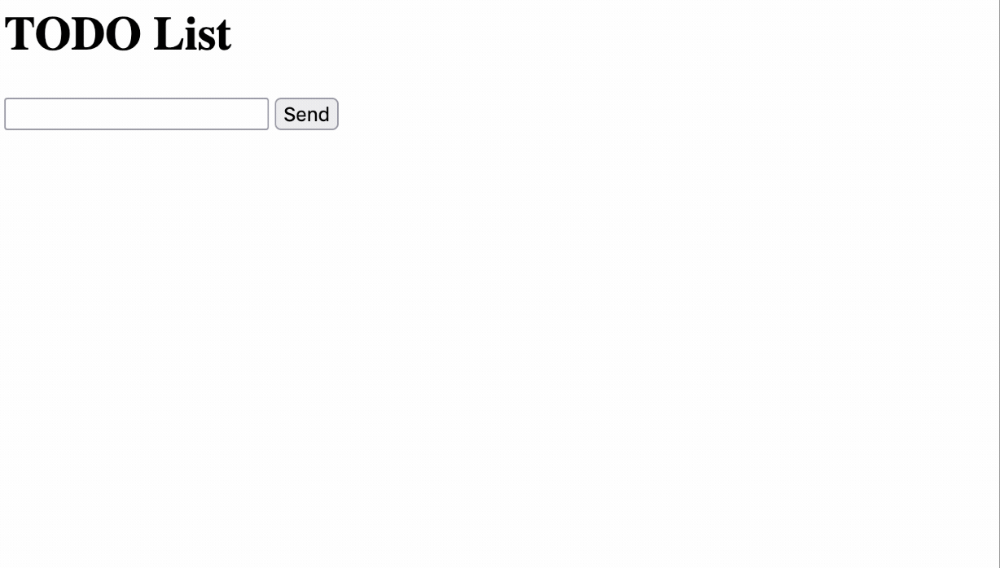

# About
This project is a place for me to learn how to use Go. It is a simple implementation of a todo list, where the goals were:

1. All of the necessary files should be packaged with the executable, so that it can be used cross-platform
2. The vast majority of the logic should happen in the backend, to give me an excuse to use more Go

I'm not sure who would use this, and I don't expect to support this for any amount of time. If for some reason the code is useful for you, feel free to use it.
